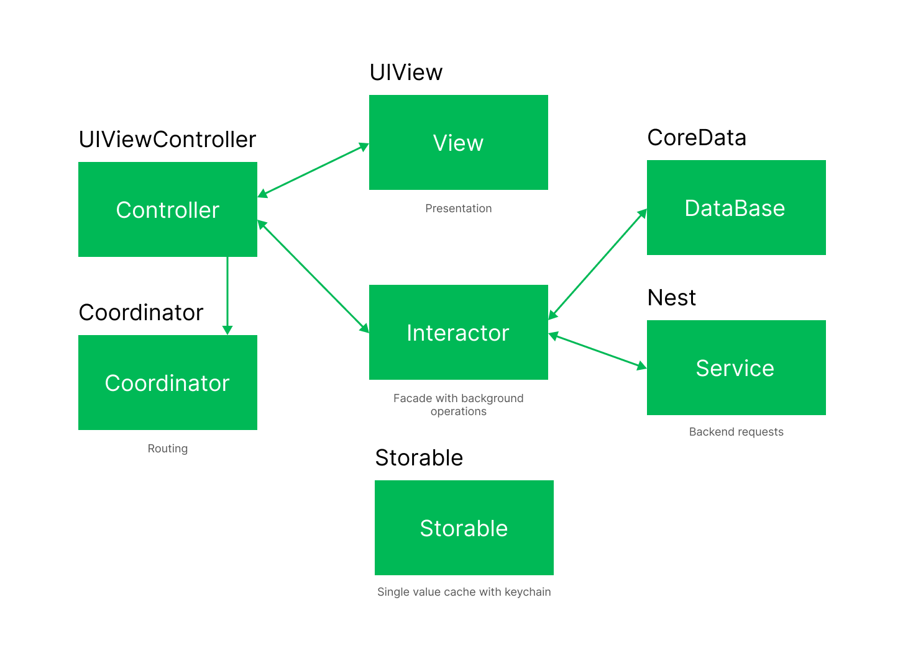

# MD Xcode File Templates

Architecture scheme:


## Installation
- You have to copy templates files from this repository to your Xcode templates dir by doing next steps.
### Clone
- Clone this repo to your local machine
```shell
$ git clone https://github.com/NGdev1/XcodeTemplates
$ cd XcodeTemplates
```
### to copy files to Xcode templates dir, run install.command
> first, allow permissions to installation file
```shell
$ chmod u+x install.sh
```
> now install templates
```shell
$ ./install.sh
```
- to remove templates, do the same with remove.sh file

## Resources:
- http://jeanetienne.net/2017/09/10/advanced-xcode-template.html
- https://github.com/quickbirdstudios/XCoordinator
- https://github.com/Moya/Moya

## TODO: - Create template for project
- https://www.hackingwithswift.com/articles/158/how-to-create-a-custom-xcode-template-for-coordinators